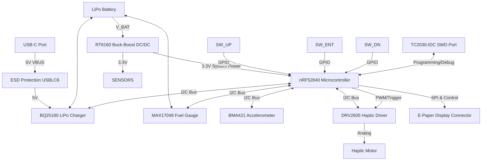

# InkTime

Designed for optimal energy efficiency, InkTime is a custom e-paper smartwatch project. This document serves as a complete technical reference for the project.

## Block Diagram(Architecture)

## Functionality

### Power Subsystem & Energy Management

Charging Input: Power is supplied via a 16-pin USB-C connector. The data lines are safeguarded against plug-in transients by a USBLC6-2SC6Y TVS diode array.

Battery Charging (BQ25180): A highly integrated linear charger tailored for small wearables. It features power-path management (allowing the device to run on USB power while charging) and interfaces with the MCU via I2C for dynamic charge current configuration and fault monitoring.

Fuel Gauge (MAX17048): Connected directly to the battery, this IC determines the State-Of-Charge (SOC) using voltage measurements and characterization algorithms. This eliminates the need for a power-wasting current sense resistor, reporting battery percentages cleanly over I2C.

Voltage Regulation (RT6160): Because LiPo voltages fluctuate between 4.2V and 3.0V, this Buck-Boost converter guarantees a stable 3.3V supply. It bucks down when the battery is full and boosts up as it depletes, maximizing the usable battery cycle.

Power Consumption Targets: The system aims for < 10 µA in Deep Sleep (MCU + Sensors suspended + Power ICs quiescent). Active processing consumes roughly 4-6 mA, while a display update will draw 10-15 mA for 2-3 seconds depending on the panel.

### Motion Sensing

IMU (BMA421): A Bosch ultra-low-power accelerometer optimized for wearables. It features a built-in hardware step-counter, allowing the MCU to remain in deep sleep while the sensor actively counts steps. The MCU only wakes periodically to sync the data via I2C.

### User Interface & Output

E-Paper Display (EPD): Interfaces through a standard 24-pin FPC connector. The onboard charge-pump circuit utilizes MBR0530 diodes, inductors, and DMG2305UX switching MOSFETs to generate the high drive voltages (+15V/-15V) needed to manipulate the e-ink microcapsules. The MCU can completely sever power to this circuit to prevent standby leakage.

Haptic Feedback (DRV2605): An I2C-connected haptic driver that contains an internal library of waveforms (clicks, buzzes, ramps). This delivers crisp tactile feedback to ERM or LRA motors without requiring the MCU to generate complex PWM signals.

Physical Inputs: Three tactile buttons (SW_UP, SW_ENT, SW_DN) feature hardware debouncing via 0.1uF capacitors. They utilize internal pull-ups and trigger MCU interrupts to wake the system from sleep.
