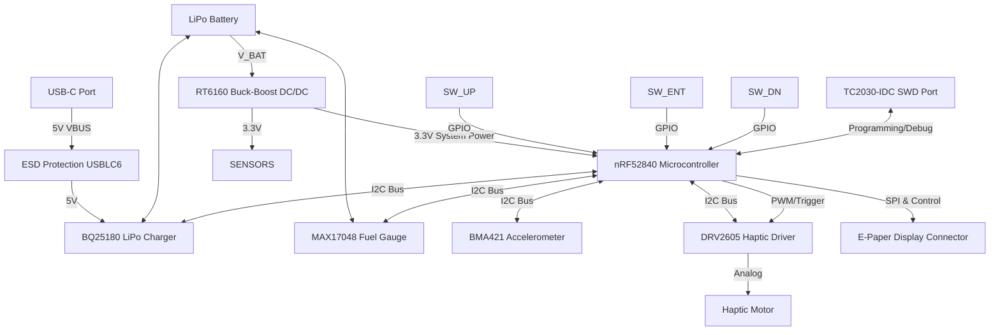

# InkTime

Designed for optimal energy efficiency, InkTime is a custom e-paper smartwatch project. This document serves as a complete technical reference for the project.

## Block Diagram(Architecture)

